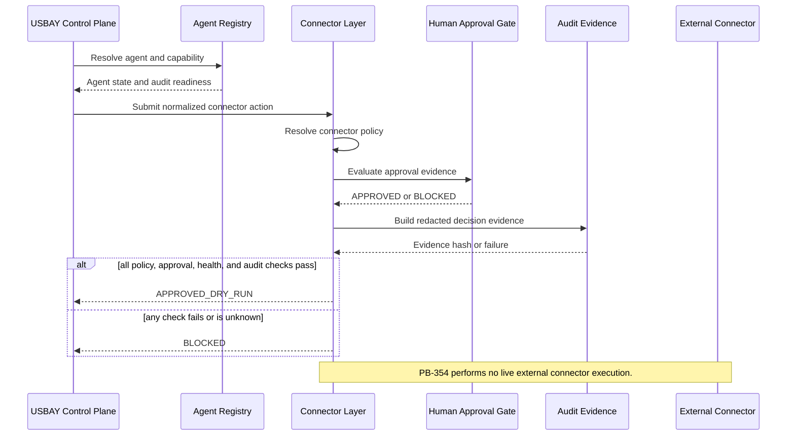

# PB-354 Connector Layer Architecture

Status: PB-354_ARCHITECTURE_ONLY

This document defines the governed USBAY Connector Layer architecture. It is an architecture-only artifact. It does not implement live connectors, change gateway/runtime behavior, alter policy rules, mutate audit evidence, or start EURIA, Orchestrator, or Dashboard work.

## Objective

The Connector Layer provides a single governed boundary between the USBAY Control Plane and external systems:

- GitHub
- Notion
- LinkedIn
- Email
- Tasks

The layer may evaluate, prepare, validate, and produce dry-run evidence. It must not perform external mutations unless a future implementation phase supplies explicit policy approval, human approval, connector capability proof, and append-only audit evidence.

## Existing Components Reused

The architecture reuses these existing USBAY components:

- `governance/connector_framework.py`
  - Existing dry-run connector policy and action evaluator.
  - Existing fail-closed blockers for unknown connectors, missing permissions, missing approvals, connector errors, non-dry-run requests, and sensitive payload handling.
- `governance/connector_orchestrator_simulation.py`
  - Existing simulated connector workflow model and dry-run workflow reporting.
- `governance/human_approval_gate_contract.py`
  - Existing human approval evidence requirements and self-approval/auto-merge/production-execution blockers.
- `audit/audit_writer.py`
  - Existing redacted audit writer contract.
- `audit/hash_chain.py`
  - Existing append-only hash-chain helper.
- `audit/ledger.py`
  - Existing append-only ledger verification model.
- `control_plane/agent_registry.py`
  - PB-353 Agent Registry dependency. At the time of this architecture artifact, PB-353 implementation is complete but publication is blocked by the Codex environment, so this integration remains a dependency until PB-353 is visible in `origin/main`.

## Proposed Connector Boundary

The Connector Layer is the only future component allowed to adapt Control Plane tasks into connector-specific requests. The boundary is intentionally narrow:

1. Receive a normalized connector action request from the Control Plane.
2. Resolve the requesting agent through the Agent Registry.
3. Resolve the connector policy and requested capability.
4. Evaluate policy and approval requirements.
5. Produce a redacted dry-run audit record.
6. Return `APPROVED_DRY_RUN` or `BLOCKED`.
7. Defer all live mutation until future explicit implementation and human approval gates exist.

The layer must not:

- Execute live GitHub, Notion, LinkedIn, Email, or Task mutations by default.
- Read or log raw secrets, raw payloads, private keys, tokens, approval contents, or sensitive runtime artifacts.
- Fall back to optimistic success when a connector, policy, approval, or audit dependency is missing.
- Mutate tracked audit evidence during tests or validations.

## Trust Boundaries

### Control Plane to Agent Registry

The Control Plane must treat agent identity and capability state as untrusted until verified by the Agent Registry.

Required checks:

- Agent is known.
- Agent is enabled.
- Agent health is acceptable.
- Agent approval state is approved or not required.
- Agent audit state is ready.

Fail-closed result:

- Unknown, disabled, unhealthy, unapproved, or unaudited agents must block connector preparation.

### Agent Registry to Connector Layer

The Connector Layer must receive only normalized agent identity and capability evidence. It must not infer authority from branch names, task titles, UI labels, or connector availability alone.

Required checks:

- Requested connector is registered.
- Requested action type is supported.
- Required permission is present.
- Agent capability covers the requested connector action.

Fail-closed result:

- Unknown connector, unsupported action, missing permission, or capability mismatch must block.

### Connector Layer to External Systems

External systems remain untrusted and unavailable by default. Connector adapters must be treated as failure-prone and capability-limited.

Required checks:

- Connector health is known and current.
- Connector capability is explicitly declared.
- Request is dry-run unless a future approved live-mutation phase permits execution.
- Connector error state is empty.

Fail-closed result:

- Connector failure, unknown health, stale health, missing capability, or live mutation request must block.

### Connector Layer to Audit Evidence

Audit evidence is mandatory for every decision, including denied decisions.

Required checks:

- Evidence can be redacted.
- Evidence hash can be computed.
- Append-only target is isolated from tracked evidence during tests.
- Audit write or dry-run record generation succeeds.

Fail-closed result:

- Missing audit hash, audit write failure, redaction failure, or unsafe payload detection must block.

## Approval Gates

The Connector Layer must apply approval gates before any external mutation and before any high-risk dry-run is promoted for human review.

Required gates:

- GitHub mutation approval
- Notion write approval
- LinkedIn publication approval
- Email send approval
- Task status mutation approval
- Terminal/destructive command approval if future connector execution delegates to terminal workflows

Minimum approval evidence:

- `validation_passed`
- `blast_radius`
- `changed_files` or requested external target summary
- `policy_version`
- `human_reviewer`
- `approval_timestamp`

Blocked approvals:

- Missing human approval evidence
- Self-approval
- Automatic merge
- Automatic production execution
- Policy version mismatch
- Validation not passed

## Fail-Closed Paths

The Connector Layer must return `BLOCKED` for:

- Unknown agent
- Disabled agent
- Unhealthy agent
- Missing agent approval
- Missing agent audit readiness
- Unknown connector
- Unknown connector action
- Missing connector permission
- Missing policy
- Missing approval
- Missing audit hash
- Audit evidence generation failure
- Connector/API failure
- Connector health unknown or stale
- Non-dry-run request in dry-run-only mode
- Unsafe terminal command
- Sensitive payload that cannot be redacted
- Any uncertainty in policy, approval, health, or audit state

No fallback path may convert `BLOCKED` into an allowed or verified state.

## Audit Evidence Requirements

Every connector decision must produce a redacted evidence object containing:

- `action_id`
- `actor`
- `agent`
- `connector`
- `requested_action`
- `policy_version`
- `policy_decision`
- `approval_state`
- `approval_evidence_hash`
- `timestamp`
- `outcome`
- `blocked_reason`
- `payload_hash`
- `audit_payload_hash`
- `evidence_hash`
- `external_mutation_performed`
- `raw_payload_logged`

Required evidence rules:

- `external_mutation_performed` must be `false` for PB-354 architecture and future dry-run contracts.
- `raw_payload_logged` must be `false`.
- Raw secrets, raw prompts, private keys, tokens, credentials, and approval contents must never be logged.
- Evidence must be deterministic and hashable.
- Audit chronology must remain append-only.
- Tests must use isolated temporary audit registries and must not dirty tracked evidence files.

## Integration Map With Agent Registry

PB-353 Agent Registry is the upstream authority for agent capability state. Once PB-353 is published into `origin/main`, the Connector Layer should integrate as follows:

1. Control Plane receives a task.
2. Control Plane resolves the requested agent in Agent Registry.
3. Agent Registry returns agent status, approval state, audit state, and declared capabilities.
4. Connector Layer maps the requested action to a connector policy.
5. Connector Layer checks agent capability against connector permission.
6. Connector Layer checks human approval requirements.
7. Connector Layer evaluates connector health and dry-run eligibility.
8. Connector Layer emits redacted audit evidence.
9. Connector Layer returns `APPROVED_DRY_RUN` or `BLOCKED`.
10. Control Plane records the decision and exposes only backend-proven state.

Dependency status:

- PB-353 implementation: complete locally.
- PB-353 publication: blocked by Codex environment at the time this document was written.
- PB-354 implementation: blocked until PB-353 is merged into `origin/main` and reviewed.

## Sequence

## Human Review Gates

Human review is required before any future Connector Layer implementation can:

- Enable live GitHub mutations.
- Write to Notion.
- Publish to LinkedIn.
- Send email.
- Mutate task state.
- Change connector policy.
- Change audit evidence schema.
- Change approval requirements.
- Change fail-closed behavior.

Review must verify:

- Scope is limited to one connector capability.
- Required checks are green.
- Evidence is present and redacted.
- No tracked evidence files were mutated.
- No policy widening occurred.
- No self-approval or automatic merge path exists.

## Implementation Constraints For Future PBs

Future implementation PBs must remain isolated:

- One connector capability per branch.
- One PR per connector capability.
- No live external mutation until explicitly scoped.
- No branch protection changes.
- No workflow changes unless explicitly scoped.
- No evidence deletion or rewrite.
- No runtime/gateway/policy changes unless explicitly approved.

Recommended future PB sequence:

1. PB-354A: Connector Layer contract tests only, after PB-353 merges.
2. PB-354B: Connector policy registry normalization for GitHub, Notion, LinkedIn, Email, and Tasks.
3. PB-354C: Dry-run connector adapter interfaces with no live external mutation.
4. PB-354D: Audit evidence recorder integration using isolated temporary stores in tests.
5. PB-354E: Human approval gate integration tests for high-risk connector actions.

## Governance Impact

This architecture artifact introduces no runtime behavior. It documents the required governance controls for a future Connector Layer and explicitly preserves:

- Fail-closed behavior
- Human approval requirements
- Audit-first evidence lineage
- No raw secret logging
- No connector execution by default
- No policy widening
- No gateway/runtime changes

Status: PB-354_ARCHITECTURE_ONLY
