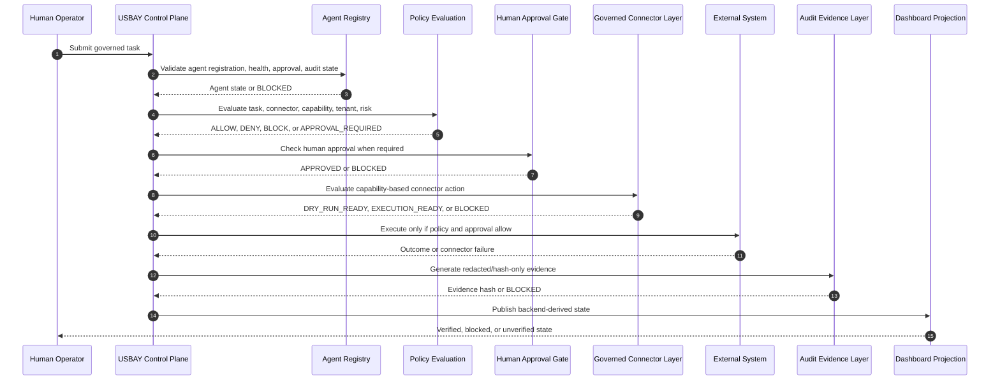
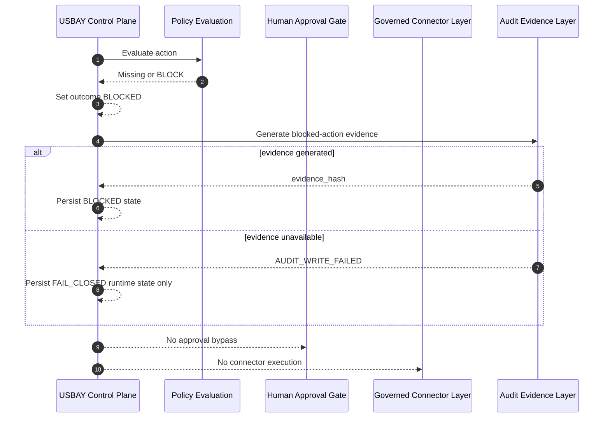
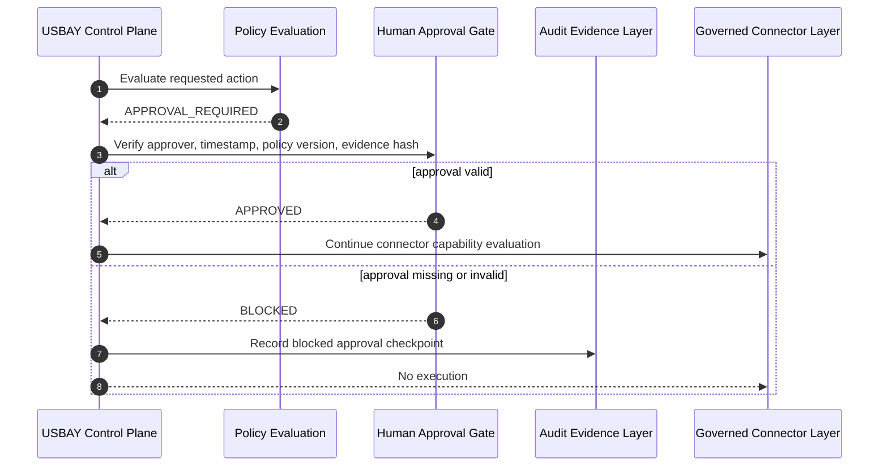
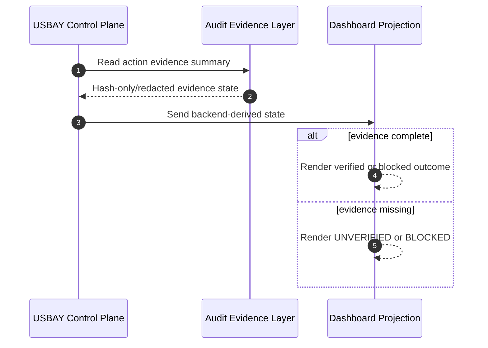

# USBAY Control Plane Sequence

Status: PHASE_1_ARCHITECTURE_ONLY

## Nominal Governed Flow

## Required Execution Pipeline

1. Receive task.
2. Validate task schema and required governance metadata.
3. Validate agent registration and health.
4. Evaluate policy.
5. Check human approval when required.
6. Evaluate connector capability and auth state.
7. Execute connector action only when permitted.
8. Generate audit evidence.
9. Store evidence through append-only audit flow.
10. Update control-plane state.
11. Render dashboard from backend evidence only.

## Fail-Closed Sequence

## Human Approval Sequence

## Dashboard Update Sequence

## Phase 1 Sequence Constraints

Phase 1 defines the sequence only. It does not implement execution, connector calls, dashboard rendering, or audit writes.
