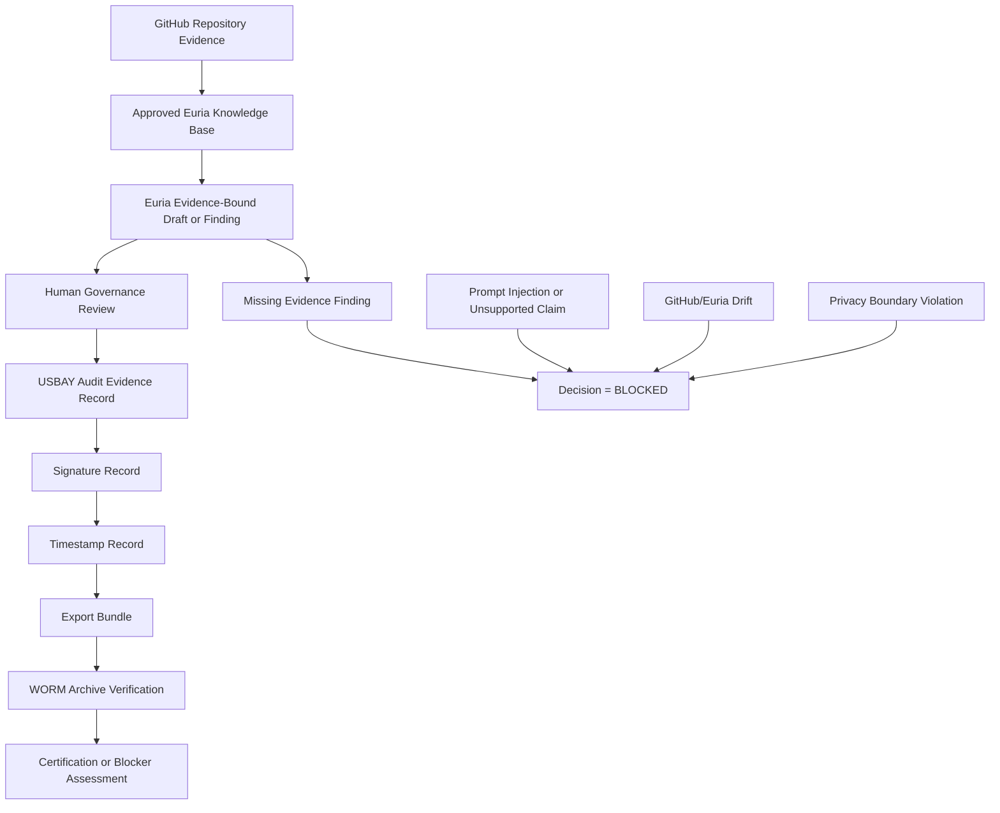

# Euria Data Flow

Purpose: define governed data flows between USBAY repository evidence, Euria project assistance, human review, audit evidence, and fail-closed enforcement boundaries.

Runtime impact: none.

Certification claim: none.

Default decision: BLOCKED.

## Data Flow Diagram



## Source Data Flow

Source data starts in GitHub repository evidence.

Allowed source inputs:

- Architecture documents.
- Governance policies.
- Audit dossiers.
- Evidence schemas.
- Validation scripts.
- Certification blocker registers.
- Approved Euria governance knowledge base documents.

Source data must not originate from undocumented memory, chat claims, verbal approval, founder approval, confidential approval, or unreviewed external statements.

## Euria Intake Flow

Euria intake flow:

1. Receive a user question, email drafting request, governance status request, or review preparation request.
2. Search approved USBAY governance knowledge.
3. Identify explicit written evidence.
4. Determine whether the requested output is within Euria authority.
5. Draft only within the evidence scope.
6. Return `Information not provided.` when evidence is missing.
7. Return `Decision = BLOCKED` when approval, deployment, override, certification, compliance, authority, risk status, ownership, or governance status is requested without documented evidence.

## Audit Evidence Flow

Audit evidence flow:

1. Euria output is generated as advisory material.
2. Human reviewer compares output to GitHub evidence.
3. Human reviewer records approval, rejection, or blocked decision in USBAY-controlled evidence.
4. USBAY audit record captures actor, device, decision, timestamp, and policy version where applicable.
5. Signature metadata binds the reviewed record.
6. Timestamp metadata binds chronology.
7. Export bundle packages evidence for independent review.
8. WORM archive verification preserves immutable evidence where required.

Euria output alone is not audit evidence sufficient for enforcement.

## Human Approval Flow

Human approval flow:

1. Euria prepares an evidence-bound packet.
2. Reviewer verifies source evidence.
3. Reviewer confirms policy, scope, and required controls.
4. Reviewer records an explicit decision.
5. USBAY audit evidence records the decision.
6. USBAY enforcement systems consume only validated USBAY state.

If review evidence is incomplete:

```text
Decision = BLOCKED
```

## Privacy Flow

Privacy flow:

1. Classify requested data before upload or use.
2. Permit only approved governance documents into Euria.
3. Redact sensitive evidence before Euria use.
4. Use hash references for sensitive evidence where possible.
5. Keep credentials, secrets, private keys, raw customer payloads, raw regulated evidence, and non-redacted regulator exports outside Euria.

If data classification cannot be established:

```text
Decision = BLOCKED
```

## Drift Flow

Drift flow:

1. Euria identifies a conflict between project knowledge, Notion navigation, user claims, and GitHub repository evidence.
2. Euria reports the conflict.
3. Euria does not resolve the conflict by inference.
4. Human reviewer checks GitHub evidence.
5. Non-authoritative summaries are updated only after repository evidence is confirmed.

If drift affects a decision:

```text
Decision = BLOCKED
```

## Fail-Closed Data Flow

Fail-closed triggers:

- Missing source evidence.
- Missing approval evidence.
- Missing policy text.
- Missing audit evidence.
- Missing signature evidence.
- Missing timestamp evidence.
- Missing audit lineage.
- Missing export evidence.
- Missing WORM evidence.
- Missing provider evidence.
- Prompt injection.
- Privacy boundary uncertainty.
- GitHub/Euria evidence drift.

Fail-closed outputs:

```text
Decision = BLOCKED
```

```text
Information not provided.
```

## Data Flow Non-Goals

This data flow does not implement runtime synchronization.

This data flow does not authorize Euria to execute actions.

This data flow does not grant Euria policy or approval authority.

This data flow does not change USBAY branch protection, enforcement logic, audit format, or certification blocker status.
