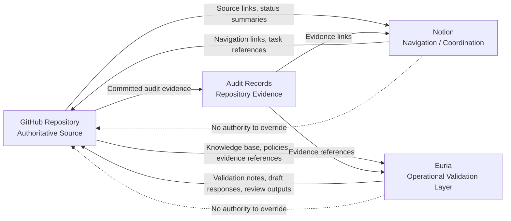

# GitHub Notion Euria Synchronization Architecture

Purpose: define the governance synchronization architecture between GitHub, Notion, and Euria without changing runtime behavior, gateway behavior, certification state, or blocker status.

Runtime impact: none.

Gateway impact: none.

Certification impact: none.

Blocker status impact: none.

## Source Authority Rules

GitHub remains the authoritative source for:

- Governance policies.
- Architecture decisions.
- Certification decisions.
- Blocker registers.
- Claim-level traceability.
- Evidence packages.
- Audit dossiers.
- Validation scripts and tests.
- Runtime implementation references.

Notion remains a navigation and coordination layer only.

Notion may:

- Link to GitHub source files.
- Summarize repository status.
- Coordinate review tasks.
- Track follow-up work.
- Help reviewers find authoritative evidence.

Notion must not:

- Override GitHub.
- Become the source of truth.
- Host authoritative architecture content.
- Host authoritative certification decisions.
- Host authoritative evidence packages.
- Close blockers.
- Create certification claims.

Euria remains an operational layer.

Euria may:

- Read the GitHub-authoritative knowledge base.
- Draft governed responses from explicit evidence.
- Execute evidence-only validation prompts.
- Run regression/certification checklists.
- Produce operational review notes.

Euria must not:

- Override GitHub.
- Invent missing evidence.
- Close blockers without repository evidence.
- Treat Notion status as authoritative evidence.
- Create certification claims.

## Data Flow Diagram

## Event Synchronization Model

Synchronization events must originate from GitHub evidence or be reconciled back into GitHub before they can affect governance state.

Event types:

- Repository policy update.
- Architecture decision update.
- Certification blocker update.
- Evidence package update.
- Audit dossier update.
- Validation script update.
- Euria operational review output.
- Notion navigation index update.

Event rules:

1. GitHub-originated events may update Notion navigation links and Euria project knowledge sources.
2. Notion-originated events may create tasks or navigation updates only.
3. Euria-originated events may create review notes, drafts, or validation outputs only.
4. Any governance state change must be committed in GitHub.
5. Any certification or blocker state change must be supported by GitHub evidence.
6. Any event without repository evidence remains informational only.

## Audit Logging Requirements

Every synchronization event that affects governance review must record:

- Event type.
- Event actor.
- Event timestamp.
- Source system.
- Target system.
- GitHub source path.
- Commit SHA when available.
- Evidence reference.
- Decision impact.
- Validation status.

If an event lacks a GitHub source path or evidence reference:

Decision: BLOCKED.

Audit logs must not contain:

- Secrets.
- Provider credentials.
- Raw payloads.
- Approval contents.
- Private keys.
- Raw regulator exports.

## Failure Handling

If GitHub is unavailable:

- Do not accept Notion as authoritative fallback.
- Do not accept Euria as authoritative fallback.
- Mark synchronization as blocked.
- Preserve existing repository state.

Decision: BLOCKED.

If Notion is unavailable:

- Continue to use GitHub as authority.
- Mark navigation sync as delayed.
- Do not change governance state.

If Euria is unavailable:

- Continue to use GitHub as authority.
- Mark operational validation as delayed.
- Do not change governance state.

If systems disagree:

- GitHub remains authoritative.
- Mark the disputed claim as blocked.
- Open or update a repository issue, audit note, blocker register, or traceability item.
- Do not close blockers or create certification claims until reconciled in GitHub.

Decision: BLOCKED.

## Drift Prevention Controls

Required controls:

- Notion pages must link back to GitHub source files.
- Euria knowledge base imports must reference GitHub source paths.
- Status summaries must include source path and commit SHA when available.
- Blocker status changes must occur only in GitHub.
- Architecture decisions must occur only in GitHub.
- Evidence packages must originate in GitHub or be referenced by GitHub.
- Drift checks must compare Notion and Euria summaries against GitHub source files.
- Missing source links must fail closed.

Drift indicators:

- Notion status differs from GitHub.
- Euria output differs from GitHub evidence.
- Notion page lacks GitHub source links.
- Euria response cites unavailable evidence.
- Blocker state appears outside GitHub without a matching repository change.
- Certification status appears outside GitHub without a matching repository change.

Drift outcome:

Decision: BLOCKED.

## Fail-Closed Behavior

Fail closed when:

- GitHub source evidence is missing.
- Notion and GitHub disagree.
- Euria and GitHub disagree.
- Notion lacks required GitHub links.
- Euria lacks explicit written evidence.
- Synchronization event lacks audit metadata.
- Evidence package reference is missing.
- Certification or blocker state is asserted outside GitHub.

Fail-closed decision:

Decision: BLOCKED.

GitHub remains authoritative.

Notion remains navigation only.

Euria remains operational only.

No synchronization event may create a certification claim, close a blocker, or override repository evidence.
