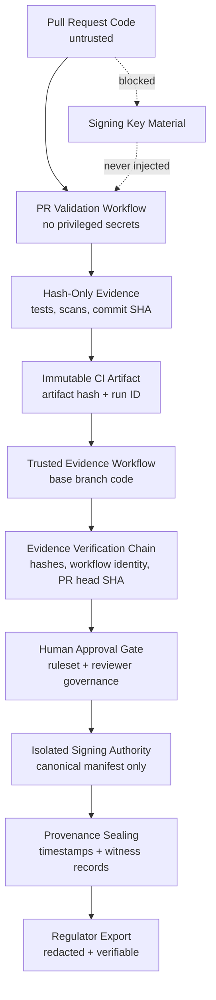

# USBAY Trusted Evidence Generation Architecture

This document formalizes the trusted evidence generation architecture identified during the PR #71 production-readiness investigation. It is architecture documentation only. It does not grant workflow authority, signing authority, merge authority, or runtime approval authority.

## Governance Finding

PR-controlled execution contexts are untrusted. A pull request can modify dependency metadata, workflow-adjacent files, tests, scripts, or build behavior. Exposing privileged governance signing material inside that context would allow a malicious or compromised change to attempt secret exfiltration, forged evidence generation, or CI privilege escalation.

USBAY must never expose privileged governance signing material to PR-controlled execution contexts.

## Trust Boundaries

| Boundary | Trust Level | Allowed Inputs | Prohibited Capabilities |
| --- | --- | --- | --- |
| Pull request validation | Untrusted | PR checkout, hash-only dependency inventory, bounded tests, static analysis, unsigned evidence summaries | Signing keys, regulator exports, mutable trust registries, release credentials |
| PR evidence staging | Constrained | Hashes, test result metadata, workflow run identifiers, commit SHAs, redacted diagnostics | Raw secrets, private keys, raw approval contents, mutable provenance authority |
| Trusted evidence generation | Trusted | Immutable PR validation artifacts, base-branch workflow code, GitHub event metadata, human approval state | Executing PR-controlled scripts with privileged secrets |
| Signing authority | Privileged | Canonical evidence manifest hash, approved trust policy, isolated signing request | PR-controlled commands, arbitrary shell payloads, unreviewed evidence bodies |
| Provenance sealing | Privileged | Signed evidence manifest, chronology checkpoint, transparency/witness records | Rewriting evidence history, accepting missing lineage, unsigned provenance |
| Regulator export | Trusted read-only | Sealed evidence bundles, redacted summaries, verification reports | Raw private keys, tokens, unredacted payloads, unverifiable claims |

## Execution Model

USBAY separates validation from signing:

1. The untrusted PR workflow checks out PR code and runs bounded validation.
2. The PR workflow emits hash-only validation evidence: commit SHA, dependency lock hash, test result hashes, scanner verdicts, and redacted failure reasons.
3. The PR workflow does not receive governance signing secrets.
4. A trusted workflow, such as `workflow_run` on completion of the PR workflow, runs from reviewed base-branch workflow code.
5. The trusted workflow fetches immutable artifacts by run ID and verifies artifact hashes, commit SHA, workflow identity, and expected check names.
6. Human approval gates are checked before privileged evidence signing.
7. The signing authority signs only canonical evidence manifests that passed policy validation.
8. Provenance sealing records signed manifest hashes, chronology checkpoints, and witness/attestation outputs.
9. Regulator exports are generated only from sealed, verified, redacted evidence.

## Architecture Diagram

## Trusted Workflow Pattern

The trusted workflow must run privileged operations only after verifying immutable evidence from an untrusted workflow. It must not check out or execute the PR branch with secrets available.

Required controls:

- use base-branch workflow definitions for privileged signing
- verify the triggering workflow name, run ID, head SHA, and conclusion
- download artifacts by immutable run reference
- verify artifact hash before parsing
- parse evidence with strict schemas
- reject malformed, missing, stale, or contradictory artifacts
- require human approval evidence before signing governance-sensitive evidence
- sign only canonical JSON manifests, not arbitrary payloads
- preserve signed manifest hashes and timestamp records

## Hash-Only PR Validation Path

The PR workflow may produce:

- commit SHA and parent SHA hashes
- dependency lock hash
- pyproject hash
- test collection hash
- test output hash
- scanner reason codes
- redacted validation summaries
- workflow run metadata
- artifact digest

The PR workflow must not produce or access:

- private keys
- tokens
- raw secrets
- raw approval contents
- regulator export payloads
- signing authority state
- mutable trust registry state
- fake signed evidence

## Threat Model

| Threat | Attack Path | Required USBAY Control | Fail-Closed Result |
| --- | --- | --- | --- |
| Malicious PR | PR modifies scripts to read environment secrets | no privileged secrets in PR context | signing unavailable, merge blocked |
| Dependency injection | build dependency executes arbitrary code | hash-locked install and no signing secrets | validation may fail, no key exposure |
| Workflow injection | PR attempts to alter CI behavior | privileged workflow runs from base branch only | injected workflow cannot sign |
| Signing-key exposure | PR reads `USBAY_CI_EVIDENCE_PRIVATE_KEY_PEM` | secret never injected into PR workflows | evidence generation blocked |
| Provenance forgery | PR fabricates signed evidence files | trusted workflow verifies signature authority and manifest hash | forged evidence rejected |
| Fake governance evidence | PR emits `PASS` text without backing artifacts | strict schema, canonical hashes, reviewer validation | false pass rejected |
| CI escalation | PR tries to use broad token permissions | read-only PR permissions and no privileged token | escalation blocked |
| Stale approval reuse | force-push invalidates prior approvals | approval freshness and head SHA binding | review required |

## Fail-Closed Enforcement

Trusted evidence generation must fail closed when:

- PR validation artifacts are missing
- artifact hashes do not match expected values
- workflow identity is ambiguous
- PR head SHA differs from the validated SHA
- required checks are missing, failed, stale, or incomplete
- reviewer approval evidence is missing or stale
- signing authority identity is ambiguous
- signing key material is unavailable
- canonical evidence schema validation fails
- provenance chronology breaks
- unsafe payload rendering is detected
- regulator export cannot be verified from sealed evidence

Failure must produce a redacted audit reason code and must not produce a signed success artifact.

## Approval Gates

Privileged evidence generation requires:

- successful untrusted PR validation
- immutable artifact verification
- required status checks for the validated SHA
- branch protection/ruleset confirmation
- reviewer governance satisfaction
- explicit human approval for governance-sensitive paths
- signing authority policy validation

AI assistance, local validation, or generated documentation must not count as human approval.

## Evidence Verification Chain

The trusted workflow verifies evidence in this order:

1. Resolve GitHub workflow run ID and repository identity.
2. Confirm the source workflow is an allowed untrusted validation workflow.
3. Confirm the run conclusion and check suite SHA.
4. Download evidence artifacts by run ID.
5. Verify artifact digest and canonical JSON schema.
6. Verify all artifact references bind to the same PR head SHA.
7. Verify reviewer governance and branch protection state.
8. Build a canonical evidence manifest with sorted keys and stable timestamps.
9. Request signing from isolated signing authority.
10. Verify the resulting signature, timestamp, and provenance checkpoint.
11. Export only redacted, regulator-safe evidence summaries.

## Signing Authority Boundary

The signing authority is not a general-purpose CI secret. It is a restricted governance capability.

Signing authority rules:

- accept only canonical evidence manifests
- reject arbitrary command execution
- reject unknown schemas
- reject unsigned or stale trust policies
- bind signatures to commit SHA, workflow run ID, artifact digest, policy version, signer identity, and timestamp
- emit redacted audit records
- never return private key material
- never sign artifacts generated solely inside PR-controlled execution

## Provenance Sealing

Provenance sealing creates immutable checkpoints after signing:

- signed evidence manifest hash
- PR head SHA
- base branch SHA
- workflow run ID
- validation artifact digest
- reviewer governance state hash
- policy version hash
- timestamp/witness evidence hash
- regulator export hash

Sealing must be append-only. A corrected evidence record creates a new sealed checkpoint and must not rewrite prior chronology.

## Regulator Export Path

Regulator exports are generated from sealed evidence only. Exported material must be deterministic, redacted, and independently verifiable.

Allowed export content:

- signed manifest hash
- signature verification result
- timestamp verification result
- policy version
- decision reason codes
- reviewer approval hashes
- commit SHA
- workflow run ID
- artifact digests
- provenance checkpoint hashes

Forbidden export content:

- private keys
- tokens
- raw approval contents
- raw PR payloads
- raw regulator submissions
- unredacted runtime artifacts
- unverified `PASS` claims

## Branch Protection Integration

Branch protection must require:

- untrusted PR validation check
- trusted evidence generation check for governance-sensitive paths
- reviewer approval requirements
- stale approval dismissal after force-push
- signed commit verification where enforced
- no merge while trusted evidence is missing or blocked

If the trusted evidence workflow cannot run because secrets are unavailable for a Dependabot PR, the correct result is `BLOCKED` until a trusted, isolated evidence path exists.

## Determinism Requirements

Trusted evidence generation must use:

- canonical JSON with sorted keys
- stable schema versions
- fixed timestamp source from trusted workflow metadata
- hash-only references for large or sensitive artifacts
- deterministic reason codes
- deterministic failure decisions
- no dependency on wall-clock ordering except recorded trusted timestamps

## Non-Goals

This architecture does not:

- expose signing secrets to PR workflows
- weaken production-readiness enforcement
- bypass required checks
- bypass reviewer governance
- auto-approve Dependabot PRs
- execute PR-controlled code in a privileged context
- treat unsigned evidence as signed evidence
- merge blocked PRs
