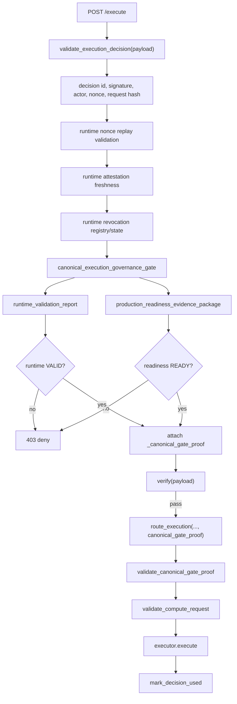
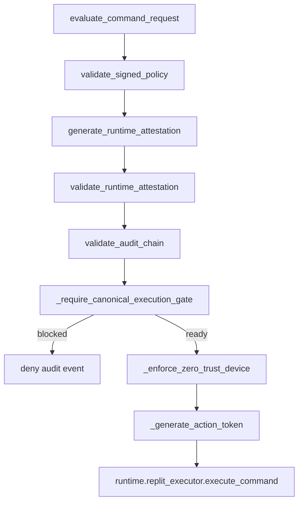
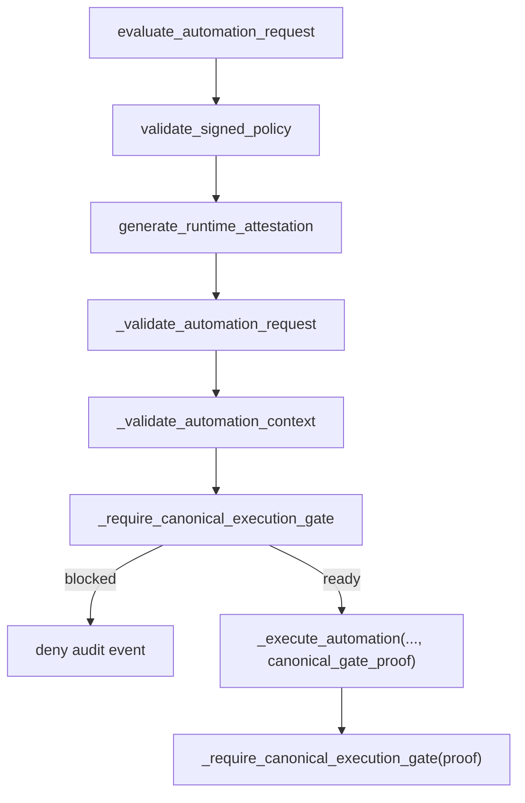

# PB-INVENTORY-001 - Execution Call Graph

Date: 2026-06-20

Canonical inventory source: `docs/audits/EXECUTION_SURFACE_MAP.md`

## Static Evidence

- `gateway/app.py`: `/execute`, `validate_execution_decision`, `canonical_execution_governance_gate`
- `security/compute_router.py`: `route_execution`, `validate_canonical_gate_proof`
- `runtime/enforcement_gateway.py`: `evaluate_automation_request`, `_execute_automation`, `evaluate_command_request`
- `security/execution_guard.py`: `execute_command` helper routes through gateway `/decide` and `/execute`

## Drift Test

`tests/test_gateway_app.py::test_execution_inventory_matches_static_call_graph`
