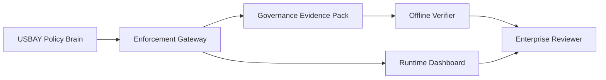
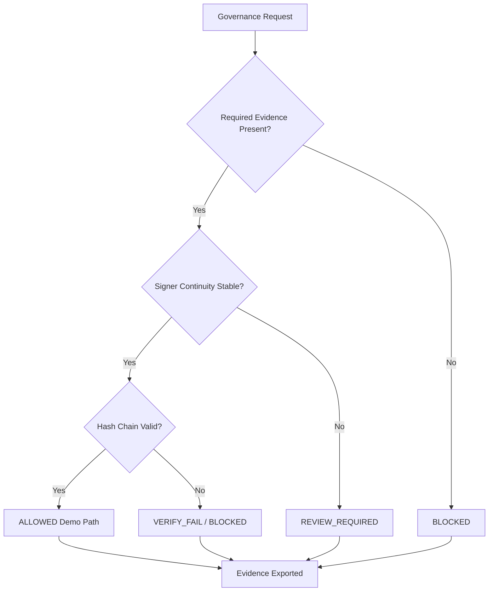
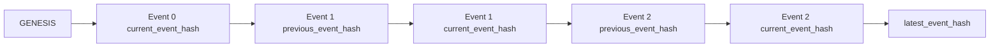
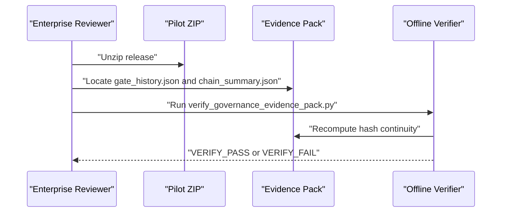

# USBAY Enterprise Architecture

This document explains the USBAY pilot review architecture for enterprise reviewers. It is visual documentation only. It does not change runtime behavior, governance enforcement, verifier logic, evidence-pack logic, or release ZIP contents.

## Runtime, Evidence, Verifier

- Runtime: the USBAY Policy Brain and Enforcement Gateway evaluate governance state and expose health/dashboard surfaces.
- Evidence: the pilot evidence pack contains hash-only gate history and chain summary artifacts for review.
- Verifier: the offline verifier validates exported evidence without network access or the live runtime.
- Demo/pilot-only: the packaged release demonstrates governance visibility and audit continuity; it is not production certification.

## Architecture Flow

## Fail-Closed Decision Flow

## Tamper-Evident Hash Chain

Each event hash is derived from the canonicalized previous event, current event payload, and signer continuity metadata. Changing an older event causes offline verification to return VERIFY_FAIL.

## Enterprise Reviewer Offline Verification

## Not Production Certification

The pilot package does not certify production deployment, approve execution, or override USBAY governance. BLOCKED and REVIEW_REQUIRED states remain visible and fail-closed.
