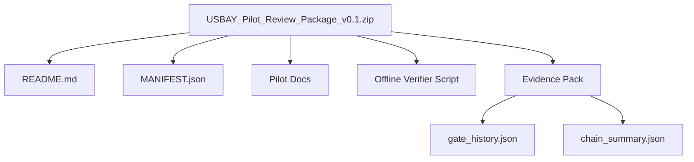
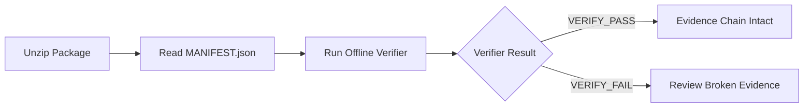
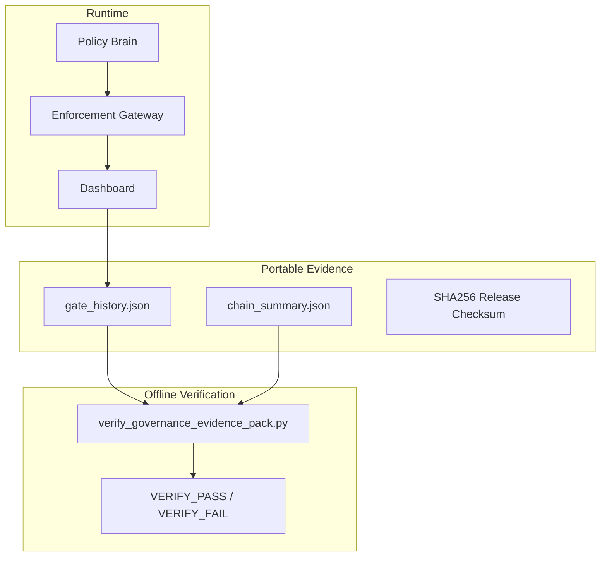

# USBAY Pilot Review Package Visual README

This visual README summarizes the pilot release package and how enterprise reviewers should inspect it. It is documentation only and makes no production certification claims.

## Package Contents



## Evidence Review Path



## Runtime Versus Evidence



## Pilot Scope

- Runtime: shows governance dashboard state and health surfaces.
- Evidence: contains hash-only pilot gate history and signer continuity metadata.
- Verifier: validates evidence offline without network access.
- Demo/pilot-only: demonstrates audit visibility and fail-closed behavior.
- Not production certification: does not assert production readiness or approve governance actions.

## Offline Verification Command

```bash
python3 scripts/verify_governance_evidence_pack.py artifacts/governance-demo-evidence-pack
```

Expected passing output:

```text
VERIFY_PASS
```

If evidence is missing, malformed, tampered, or secret-bearing, the verifier must return VERIFY_FAIL.
